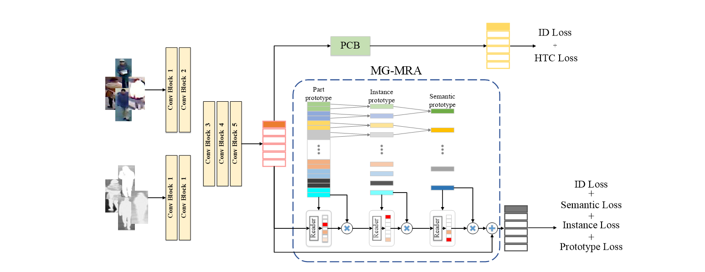
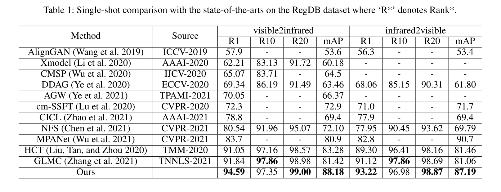

# **[Memory Regulation and Alignment toward Generalizer RGB-Infrared Person Re-identification](https://arxiv.org/abs/2109.08843)**


 ### Updates
 1 I re-upload the MG-MRA related code. I already try it on my computer. It should be ok.
 
 2 You may notice that the input of each stage of MG-MRA is different from that of the paper. These two settings have a similar performance, i.e., one is better in RegDB, one is better in SYSU. I did not heavily tune my code with better hyper-parameters, so you may achieve little improvement than report.
 
 3 Some reviewers can not understand how MGMRA works and updates. You can refer to Vit since MGMRA is similar to positional embedding as learnable nn.embedding. For understanding, you can refer to MOCO as a stable dictionary. We just explain it in Bayesian model. The paper in arxiv has some typos and is hard to read. We will modify it.
 
 4 We try this work in RGB ReID and Video ReID, It achieves similar performance as baseline model in RGB ReID and about 1% improvement in Video ReID without changing any hyper parameter.
 

### Highlights
- The learned coarse-to-fine prototypes can consistently provide domain-level semantic templets with various granularity, meeting the requirement for multi-level semantic alignment.
- Our proposed MG-MRA boosts the performance of baseline and existing state of the arts, e.g., AGW  and HCT  by a large margin with limited consumptions. We achieve a new state-of-the-art on RegDB  and SYSU-MM01 with 94.59%/88.18% and 72.50%/68.94% Rank1/mAP respectively.
- This work has some potential interesting settings which have not been explored, such as uncompatiblity with maxpooling as introduced in the discussion section of our paper. Moreover, some specific phenomenon show this module does a regulation work if your try to use the MGMRA brach output to evaluate. Unluckily, I have to move to my next work and can not investigate it further.

### Method


### Results




### Usage
Our code extends the pytorch implementation of Cross-Modal-Re-ID-baseline in [Github](https://github.com/mangye16/Cross-Modal-Re-ID-baseline). Please refer to the offical repo for details of data preparation.

### Training

Train original HCT method for RegDB by

```bash
python train_HCT.py --dataset regdb --lr 0.1 --gpu 0 --batch-size 8 --num_pos 4
```

Train a SG-MRA for RegDB by
```bash
python train_SGMRA.py --dataset regdb --lr 0.1 --gpu 0 --batch-size 8 --num_pos 4
```

Train a MG-MRA for RegDB by

```bash
python train_MGMRA.py --dataset regdb --lr 0.1 --gpu 0 --batch-size 8 --num_pos 4
```

Train a model for SYSU-MM01 by

```bash
python train_MGMRA.py --dataset sysu --lr 0.01 --batch-size 6 --num_pos 8 --gpu 0
```

**Parameters**: More parameters can be found in the manuscript and code.

### Reproduction
Our code should be easy to reproduce the results reported in paper. You can train it directly. We also provide weight file (our model on SYSU all search, on 10 trials of RegDB) for fast evaluation. You can download it from (link：https://pan.baidu.com/s/1Hs74Qsii0sK15ELt_wQH_Q 
code：1111)and verify the performance as following table.

| RegDB trial  visible2infared | Rank1 | mAP   |
| ---------------------------- | ----- | ----- |
| 1                            | 93.50 | 93.84 |
| 2                            | 95.24 | 95.07 |
| 3                            | 93.01 | 93.29 |
| 4                            | 93.30 | 93.73 |
| 5                            | 96.80 | 95.98 |
| 6                            | 94.85 | 93.88 |
| 7                            | 95.73 | 95.47 |
| 8                            | 95.49 | 95.34 |
| 9                            | 93.98 | 93.94 |
| 10                           | 95.05 | 94.57 |
| mean                         | 94.7  | 94.5  |

### Reference
```
@article{chen2021memory,
  title={Memory Regulation and Alignment toward Generalizer RGB-Infrared Person},
  author={Chen, Feng and Wu, Fei and Wu, Qi and Wan, Zhiguo},
  journal={arXiv preprint arXiv:2109.08843},
  year={2021}
}

@article{arxiv20reidsurvey,
  title={Deep Learning for Person Re-identification: A Survey and Outlook},
  author={Ye, Mang and Shen, Jianbing and Lin, Gaojie and Xiang, Tao and Shao, Ling and Hoi, Steven C. H.},
  journal={arXiv preprint arXiv:2001.04193},
  year={2020},
}
```
